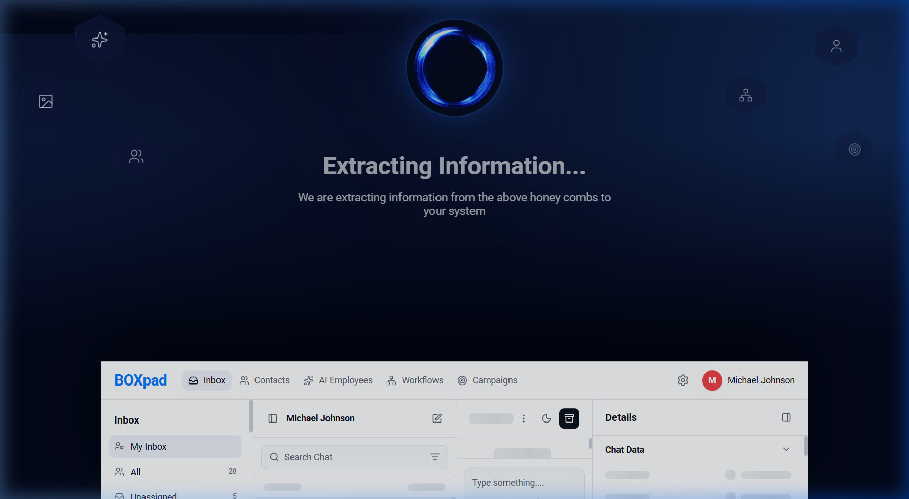
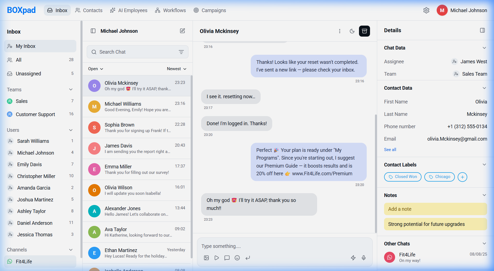

# BOXpad — Unified Customer Inbox

A pixel-perfect implementation of the BOXpad customer support dashboard, built for the Front-End Screening Assignment.

## 📸 Screenshots

### 1. Cinematic Intro Screen
The high-fidelity extraction animation with floating honeycombs and an energy portal.


### 2. Main Dashboard
The fully loaded dashboard featuring a three-panel layout, premium typography, and multi-channel support.


## 🚀 Overview

BOXpad is a premium, AI-powered customer support inbox. This project demonstrates a high-fidelity UI implementation with a complex loading sequence, multi-channel messaging support, and a fully responsive layout.

### Key Features

- **Premium Intro Sequence**: A cinematic 4-second loading screen with floating honeycombs (hexagons) and an energy-ring portal animation.
- **Progressive Loading**: Seamless transition from the intro screen to an app-skeleton state, then to the fully loaded dashboard.
- **Responsive Design**: Mobile-first architecture with dedicated views for "List" and "Chat", drawer-based navigation, and adaptive component sizing.
- **API Integration**: Real-time data fetching using the DummyJSON API to populate the conversation list and contact details.
- **Interactive Messaging**: Functional chat window with message bubble animations, sending logic, and real-time auto-scroll.

## 🛠️ Tech Stack

- **Framework**: [TanStack Start](https://tanstack.com/router/v1/docs/guide/start/overview) (React 19 + TypeScript)
- **Styling**: [Tailwind CSS v4](https://tailwindcss.com/blog/tailwindcss-v4-alpha) (using OKLCH color spaces for modern rendering)
- **Animations**: [Framer Motion](https://www.framer.com/motion/)
- **Icons**: [Lucide React](https://lucide.dev/) & [React Icons](https://react-icons.github.io/react-icons/)
- **Routing**: [TanStack Router](https://tanstack.com/router)

## 📡 API Integration

The application integrates with the **DummyJSON API** to simulate real-world data handling:

- **Endpoint**: `https://dummyjson.com/users?limit=10`
- **Usage**:
  - Fetches user data to populate the **Conversation List**.
  - Dynamically updates the **Details Panel** and **Chat Header** based on the selected contact.
  - Implements graceful error handling with fallbacks to cached local data if the API is unreachable.

## 📦 Project Structure

```text
src/
├── assets/             # Images, GIFs, and brand assets
├── components/         # Modular UI components
│   ├── boxpad/         # Dashboard-specific components (TopBar, Sidebar, etc.)
│   ├── ui/             # Reusable primitive components (Shadcn-like)
│   └── LoadingSkeletonScreen.tsx # Cinematic intro component
├── hooks/              # Custom React hooks (useIsMobile, etc.)
├── routes/             # TanStack Router routes (index logic)
└── styles.css          # Global Tailwind configurations and variables
```

## ⚙️ Setup Instructions

1. **Clone the repository**:

   ```bash
   git clone <repository-url>
   cd pixel-perfect-ui
   ```

2. **Install dependencies**:

   ```bash
   npm install
   ```

3. **Run the development server**:

   ```bash
   npm run dev
   ```

4. **Build for production**:
   ```bash
   npm run build
   ```

## 📝 Assumptions & Notes

- **Animations**: The 4-second intro duration was chosen to give enough time for the "honeycomb" extraction animation to feel premium.
- **Mobile Navigation**: On mobile screens (< 768px), the layout switches to a single-panel view (Conversation List or Chat Window) to maintain usability, while the Sidebar and Details Panel are accessible via intuitive toggle buttons.
- **Icons**: I used Lucide icons that most closely match the shapes in the provided Figma design to ensure brand consistency.
